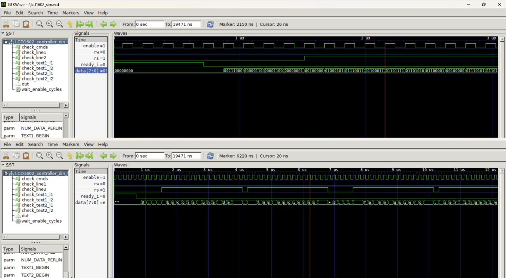

# Laboratorio 6: Visualización usando pantalla LCD 16x2.
- Daniel Felipe Loy Arias 1010960021
- Daniela Sabogal Suarez 1075792109
- Juan David García Barreto 1029142709

# Informe

Indice:

1. [Diseño implementado](#diseño-implementado)
2. [Simulaciones](#simulaciones)
3. [Implementación](#implementación)
4. [Conclusiones](#conclusiones)
5. [Referencias](#referencias)

## Diseño implementado

### Parte 1: Texto estatico

#### Descripción

#### Diagramas

### Parte 2: Texto dinámico

#### Descripción

#### Diagramas

## Simulaciones en GTKWave

### Parte 1: Texto estatico

### Parte 2: Texto dinámico

Tras realizar la simulación en GTKWave fue posible verificar el comportamiento de la máquina de estados y la correcta secuencia de señales enviadas a la LCD. Se observó inicialmente el envío de los comandos de configuración, seguido de la transmisión ordenada de los caracteres de la primera y segunda línea. Además, se comprobó el funcionamiento de los contadores y la actualización adecuada de las señales RS, Enable y del bus de datos. En la siguiente figura se muestra el bus de dato enviado por la LCD en codigo binario y en codigo ASCII.

    
    
Figura 5. Simulación en GTKWave del bus de datos para texto dinámico.

  

El codigo del testbench se encuentra en el archivo [LCD1602_controller_din_tb.v](./Simulaciones_e_Implementacion/LCD_texto_dinamico/LCD1602_controller_din_tb.v)

## Implementación

### Parte 1: Texto estatico

### Parte 2: Texto dinámico

El texto a mostrar se carga desde un archivo de texto externo ([data.txt](./Simulaciones_e_Implementacion/LCD_texto_dinamico/data.txt)) mediante $readmemh, permitiendo modificar el contenido sin alterar la estructura del controlador. El diseño se integró con la FPGA y la pantalla LCD 1602, verificando experimentalmente la correcta lectura de los caracteres y la adecuada secuencia de inicialización del dispositivo.

La evidencia de funcionamiento de la implementación se encuentra en el siguiente [video](./Imagenes/Implementacion_texto_dinamico.mp4).

## Conclusiones

- El desarrollo de este laboratorio permitió comprender el uso de las máquinas de estados y la lógica secuencial en el diseño de sistemas digitales orientados al control de dispositivos externos. A través del uso de contadores, memorias y señales de control, fue posible implementar un controlador para una pantalla LCD 1602 capaz de gestionar la inicialización y la visualización de texto, permitiendo actualizar y seleccionar la información mostrada de manera organizada y eficiente.

## Referencias

