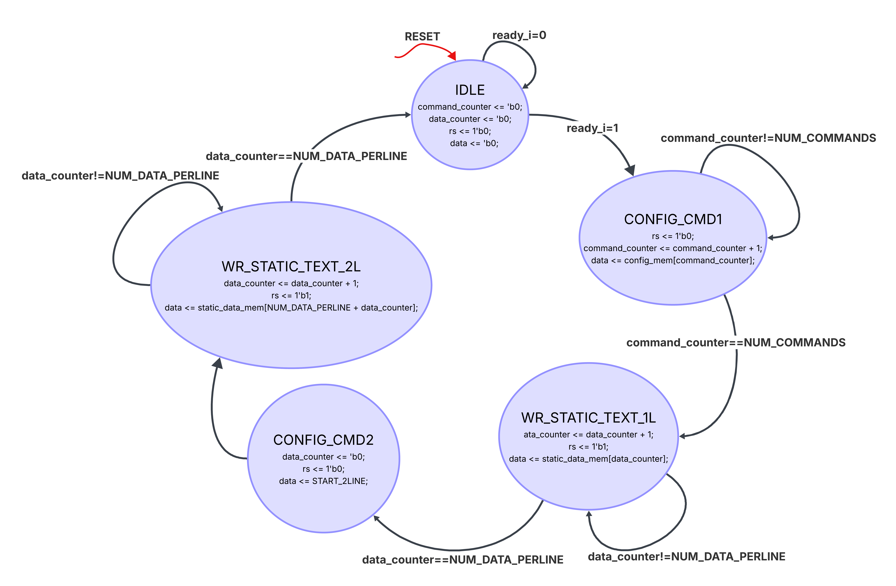
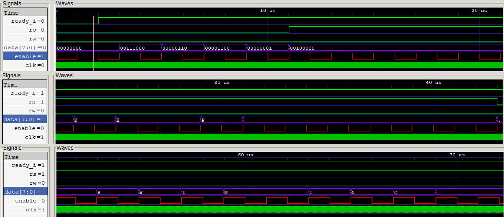
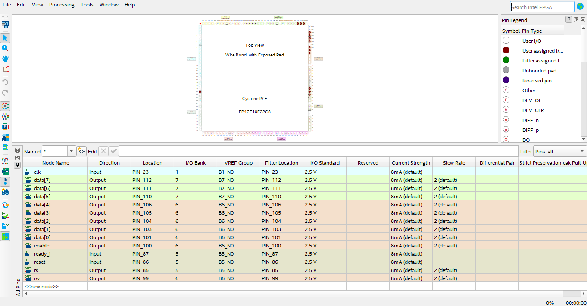

# Laboratorio 6: Visualización usando pantalla LCD 16x2.
- Daniel Felipe Loy Arias 1010960021
- Daniela Sabogal Suarez 1075792109
- Juan David García Barreto 1029142709

# Informe

Indice:

1. [Diseño implementado](#diseño-implementado)
2. [Simulaciones](#simulaciones)
3. [Implementación](#implementación)
4. [Conclusiones](#conclusiones)
5. [Referencias](#referencias)

## Diseño implementado

### Parte 1: Texto estático

#### Descripción

El módulo LCD1602_controller tiene como función controlar una pantalla LCD 16x2 mediante una máquina de estados finitos (FSM). Su propósito es inicializar la pantalla, configurar sus parámetros de funcionamiento y posteriormente escribir un mensaje almacenado en memoria. Para ello utiliza las señales de control típicas del LCD: RS (selección entre comando y dato), RW (lectura/escritura), Enable y el bus de datos de 8 bits.

El controlador almacena en una memoria interna los caracteres que se mostrarán en la pantalla, los cuales son cargados desde el archivo data.txt utilizando la instrucción $readmemh. Además, dispone de otra memoria que contiene los comandos de configuración necesarios para inicializar el LCD, como la selección del modo de operación de 8 bits, la configuración del cursor y la limpieza de la pantalla.

Para garantizar que el LCD reciba la información con la temporización adecuada, el módulo implementa un divisor de frecuencia que genera una señal de reloj más lenta (clk_16ms). Esta señal es utilizada para sincronizar el avance de la máquina de estados y el envío de comandos y caracteres hacia la pantalla.

Una vez que la señal ready_i indica que el sistema está listo, el controlador comienza la secuencia de inicialización enviando los comandos de configuración. Posteriormente escribe los primeros 16 caracteres en la primera línea del LCD, mueve el cursor al inicio de la segunda línea mediante un comando específico y finalmente escribe los 16 caracteres restantes. Cuando todo el texto ha sido enviado, el sistema retorna al estado de espera. 

La descripción de hardware para el control de la LCD se encuentra en el archivo [lcd1602_text.v](/src/lcd1602_text.v).

#### Diagramas

La Figura 1 presenta la máquina de estados finitos utilizada para controlar el funcionamiento del módulo LCD. Esta FSM organiza de manera secuencial las etapas de inicialización y escritura de información en la pantalla. Cada estado se encarga de una tarea específica, como el envío de comandos de configuración, la escritura de caracteres en cada línea del LCD o la espera de una nueva activación. Las transiciones entre estados dependen principalmente de los contadores de comandos y datos, permitiendo que la información se envíe en el orden correcto y respetando los tiempos de operación requeridos por la pantalla.

    
    
Figura 1. Diagrama de la maquina de estados (FSM) para el control de una pantalla LCD.

  

Los estados que componen la máquina de estados son los siguientes:

**IDLE:** Estado de reposo. El sistema espera a que la señal ready_i se active. En este estado se reinician los contadores y las salidas de control.

**CONFIG_CMD1:** Se envían los comandos de configuración almacenados en memoria para inicializar correctamente el LCD.

**WR_STATIC_TEXT_1L:** Se escriben secuencialmente los primeros 16 caracteres del mensaje en la primera línea de la pantalla.

**CONFIG_CMD2:** Se envía el comando que posiciona el cursor al inicio de la segunda línea del LCD.

**WR_STATIC_TEXT_2L:** Se escriben los siguientes 16 caracteres en la segunda línea. Una vez finalizada la escritura, el controlador retorna al estado IDLE.

### Parte 2: Texto dinámico

#### Descripción

#### Diagramas

## Simulaciones 

### Parte 1: Texto estático

El testbench [lcd1602_TB.v](/src/lcd1602_TB.v) instancia el módulo `LCD1602_controller` con `COUNT_MAX = 50` para acelerar el divisor de reloj de 16 ms, y genera un volcado de formas de onda en [LCD1602_controller_TB.vcd](/src/LCD1602_controller_TB.vcd), visualizado a continuación con GTKWave.

Como se observa en la Figura 4, la señal `rs` permanece en bajo durante la fase de envío de comandos, que incluye la secuencia de inicialización del LCD y el comando `START_1LINE` para posicionar el cursor al inicio de la primera línea. Luego, `rs` se pone en alto para indicar que los siguientes bytes corresponden a datos de caracteres, y se envían los caracteres de la primera línea uno por uno, con `enable` replicando el ritmo del reloj de 16 ms. La señal `ready_i` se mantiene en alto durante toda la secuencia, indicando que el controlador está listo para recibir datos, y `rw` permanece en bajo, confirmando que solo se realizan operaciones de escritura.

    
    
Figura 4. Detalle del bus de datos en binario y ASCII.

  

En conjunto, las capturas verifican que la FSM respeta el orden: comandos → línea 1 → comando de segunda línea → línea 2, y que los datos enviados coinciden byte a byte con el contenido de `data.txt`.

### Parte 2: Texto dinámico

## Implementación

### Parte 1: Texto estático

La implementación en la FPGA del texto estático se encuentra en el archivo [falta](falta). Los asignación de pines se encuentra a continuaciíon:

    
    
Figura 4. Disposición de pines oara la LCD con texto estático en la FPGA.

  

La evidencia de funcionamiento del módulo LCD se encuentra en el siguiente [video](./Imagenes/Implementacion_PWM_Servo.mp4), donde se muestra el correcto funcionamiento de la LCD junto al mensaje estático guardado en el archivo `data.txt` al ser implementado en la FPGA Cyclone IV.

### Parte 2: Texto dinámico

## Conclusiones

## Referencias