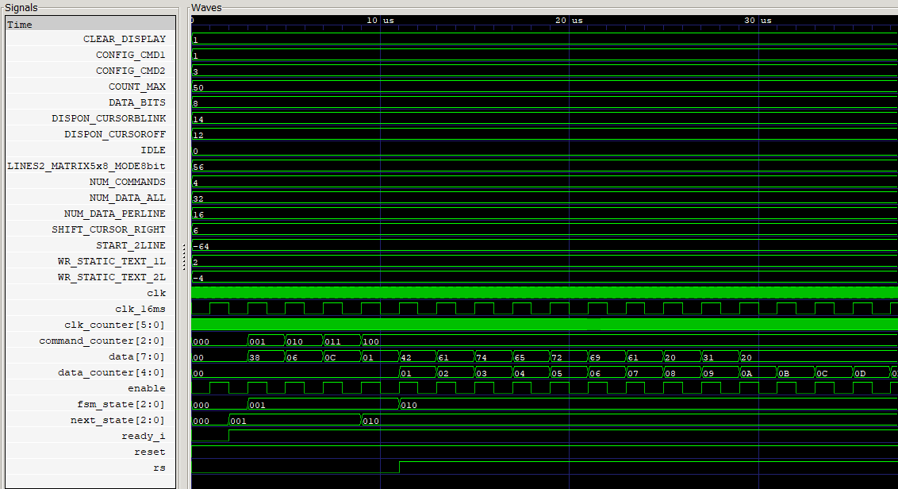

# Laboratorio 6: Visualización usando pantalla LCD 16x2.
- Daniel Felipe Loy Arias 1010960021
- Daniela Sabogal Suarez 1075792109
- Juan David García Barreto 1029142709

# Informe

Indice:

1. [Diseño implementado](#diseño-implementado)
2. [Simulaciones](#simulaciones)
3. [Implementación](#implementación)
4. [Conclusiones](#conclusiones)
5. [Referencias](#referencias)

## Diseño implementado

### Parte 1: Texto estatico

#### Descripción

#### Diagramas

### Parte 2: Texto dinámico

#### Descripción

#### Diagramas

## Simulaciones 

### Parte 1: Texto estatico

El testbench [lcd1602_TB.v](/src/lcd1602_TB.v) instancia el módulo `LCD1602_controller` con `COUNT_MAX = 50` para acelerar el divisor de reloj de 16 ms, y genera un volcado de formas de onda en [LCD1602_controller_TB.vcd](/src/LCD1602_controller_TB.vcd), visualizado a continuación con GTKWave.

    
    
Figura 3. Vista general de la simulación.

  

La captura muestra el arranque completo de la FSM: tras liberar `reset` y activar `ready_i`, `fsm_state` pasa de `IDLE (000)` a `CONFIG_CMD1 (001)`, donde `command_counter` recorre `0→4` mientras `data` saca, en orden, los cuatro comandos de configuración del LCD (`0x38`, `0x06`, `0x0C`, `0x01`). Justo después, `fsm_state` avanza a `WR_STATIC_TEXT_1L (010)`, `rs` se activa y `data_counter` empieza a incrementarse mientras `data` entrega, byte a byte, el contenido de la primera línea de `static_data_mem` (`0x42 0x61 0x74 0x65 0x72 0x69 0x61 0x20 0x31 0x20 ...`), que corresponde a la cadena `"Bateria 1"` rellenada con espacios.

    
    
Figura 4. Detalle del bus de datos en binario.

  

Esta segunda vista (en binario, sobre una ventana de tiempo mayor) confirma la misma secuencia ya con `rs` en alto durante toda la fase de escritura de caracteres: se observa el cierre de `"Bateria 1"` con los espacios de relleno (`00100000`), seguido del comando `START_2LINE` (`11000000` = `0xC0`) que reposiciona el cursor en la segunda línea, y a continuación el inicio de la segunda cadena `"Bateria 2"` (`01000010 01100001 01110100 01100101 01110010 ...` = `B a t e r ...`). La señal `enable` replica fielmente a `clk_16ms` (tal como se define con `assign enable = clk_16ms;` en el RTL), y `ready_i`/`rw` permanecen estables en `1`/`0` durante toda la secuencia, como se espera de un controlador de solo escritura.

En conjunto, ambas capturas verifican que la FSM respeta el orden comandos → línea 1 → comando de segunda línea → línea 2, y que los datos enviados coinciden byte a byte con el contenido de `data.txt`.

### Parte 2: Texto dinámico

## Implementación

### Parte 1: Texto estatico

### Parte 2: Texto dinámico

## Conclusiones

## Referencias